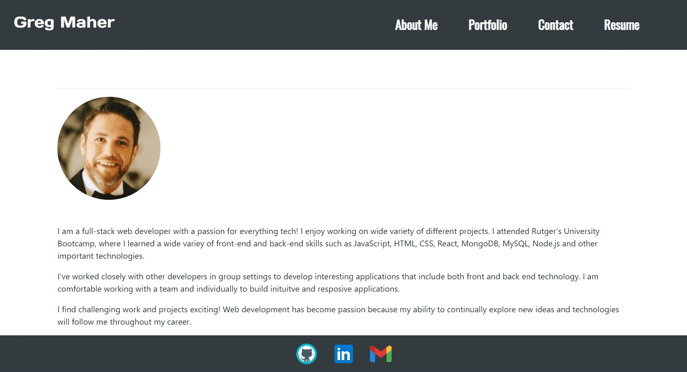
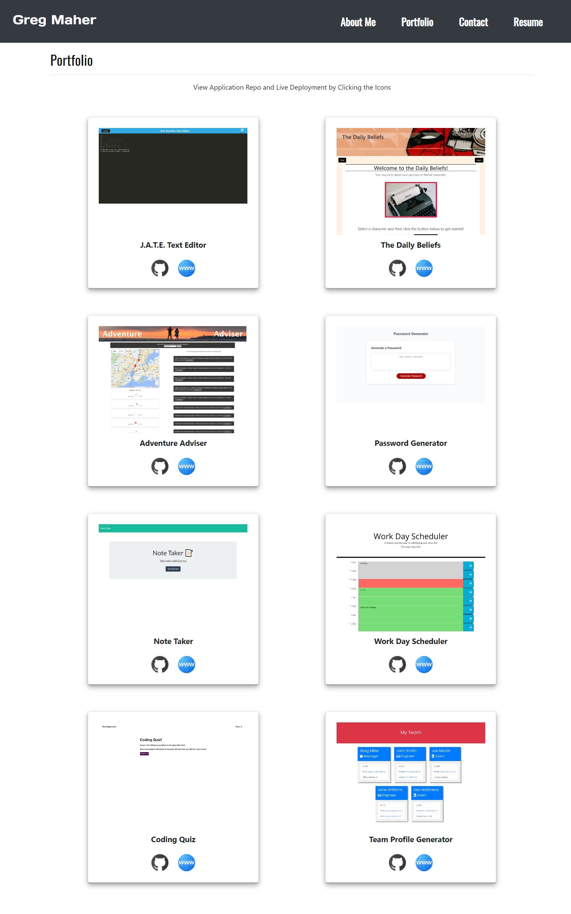
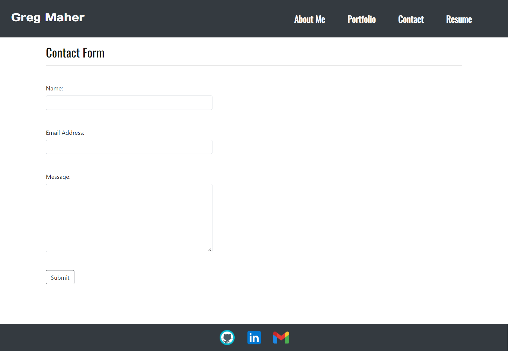
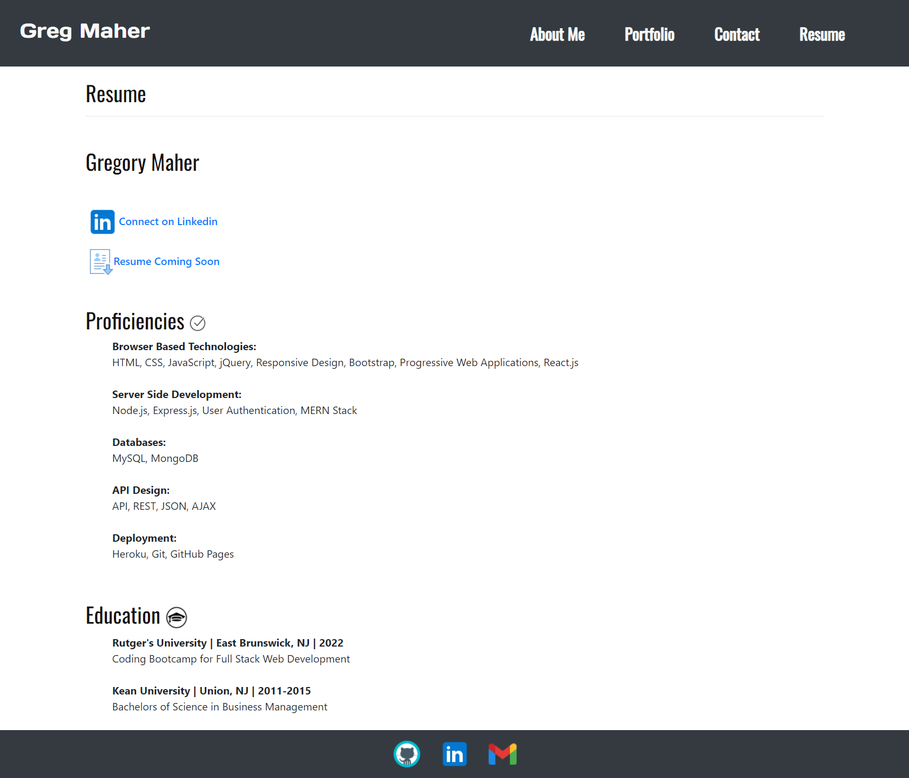

# React Portfolio

## Table-of-Contents

- [Description](#description)
- [Installation](#installation)
- [Usage](#usage)
- [Tests](#tests)
- [License](#license)
- [Questions](#questions)

## [Description](#table-of-contents)

This application is a personal portfolio website that was developed utilizing React.js.

## [Installation](#table-of-contents)

This React.js application can be installed by running `npx create-react-app` from the terminal. Any further dependencies can be installed by running `npm install <dependency name>`. Node.js must be installed first on the users computer in order to build this application. 

## [Usage](#table-of-contents)

To use this React.js application on your local machine, after installation, run `npm start` from the terminal.The application will be deployed in the browser using local host. 

### **Click on the following link to view the Deployed Site on GitHub Pages:**
http://Gregm316.github.io/gm-react-portfolio/

### **Screenshots of the React Portfolio Pages:**

## [Tests](#table-of-contents)

There are no tests for this application.

## [License](#table-of-contents)

## [Questions](#table-of-contents)

If you have any questions about this portfolio, please contact me using the following links:

[GitHub](https://github.com/Gregm316)

[Email: gregm316@gmail.com](mailto:gregm316@gmail.com)
